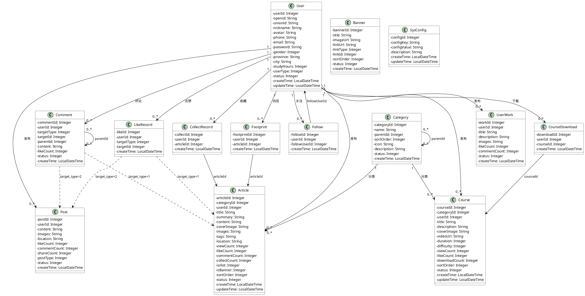

# 榫卯非遗文化传承平台

本项目是一个基于微信小程序的榫卯非遗文化传承平台，后端采用 Spring Boot + MyBatis-Plus 构建，提供内容展示、社交互动、技艺教程、用户作品等核心功能模块。

## 数据库设计方案

### 1. 设计概述

数据库采用 MySQL 5.0+ 兼容规范，字符集为 utf8，共包含 14 张核心数据表，涵盖用户体系、内容管理、社交互动、技艺教程、系统配置五大模块。设计遵循第三范式，通过外键关联与索引优化保障数据一致性与查询性能。

### 2. 模块划分

| 模块 | 包含表 | 功能说明 |
|------|--------|----------|
| 用户体系 | user | 存储注册用户与微信用户信息，支持普通用户、传承人、管理员三种角色 |
| 内容管理 | category, article, banner | 树形分类存储、富文本文章管理、首页轮播图配置 |
| 社交互动 | post, comment, like_record, collect_record, follow, footprint | 动态广场、评论互动、点赞收藏、关注关系、浏览足迹 |
| 技艺教程 | course, course_download, user_work | 视频课程管理、课程下载记录、用户作品展示 |
| 系统配置 | sys_config | 系统参数键值对配置 |

### 3. 实体关系说明

- **用户(User)** 是核心实体，与文章(Article)、帖子(Post)、课程(Course)、评论(Comment)、用户作品(UserWork)为一对多关系
- **分类(Category)** 采用自关联树形结构，parent_id 指向父分类
- **点赞(LikeRecord)** 和 **评论(Comment)** 通过 target_type + target_id 多态关联文章或帖子
- **收藏(CollectRecord)**、**关注(Follow)**、**足迹(Footprint)**、**课程下载(CourseDownload)** 均为用户与内容之间的关联记录表

### 4. 索引策略

- 所有主键均采用 AUTO_INCREMENT 自增整数
- 微信 openid、手机号、邮箱等唯一字段建立唯一索引
- 外键关联字段（如 category_id、user_id）建立普通索引
- 状态字段、排序字段、创建时间建立索引以支持列表筛选与排序
- 文章标题建立 FULLTEXT 全文索引以支持搜索功能

### 5. UML 类图



### 6. 表结构详情

#### 6.1 用户表 (user)

| 字段名 | 类型 | 约束 | 说明 |
|--------|------|------|------|
| user_id | INT(11) | PRIMARY KEY, AUTO_INCREMENT | 用户ID |
| openid | VARCHAR(64) | UNIQUE | 微信openid |
| unionid | VARCHAR(64) | - | 微信unionid |
| nickname | VARCHAR(100) | INDEX | 用户昵称 |
| avatar | VARCHAR(500) | - | 头像URL |
| phone | VARCHAR(20) | UNIQUE | 手机号 |
| email | VARCHAR(100) | UNIQUE | 邮箱 |
| password | VARCHAR(255) | - | 登录密码（加密存储） |
| gender | TINYINT(1) | DEFAULT 0 | 性别：0未知 1男 2女 |
| province | VARCHAR(50) | - | 省份 |
| city | VARCHAR(50) | - | 城市 |
| study_hours | INT(11) | DEFAULT 0 | 学习时长（小时） |
| user_type | TINYINT(1) | DEFAULT 0, INDEX | 用户类型：0普通用户 1传承人 2管理员 |
| status | TINYINT(1) | DEFAULT 1 | 状态：0禁用 1正常 |
| create_time | DATETIME | - | 创建时间 |
| update_time | DATETIME | - | 更新时间 |

#### 6.2 内容分类表 (category)

| 字段名 | 类型 | 约束 | 说明 |
|--------|------|------|------|
| category_id | INT(11) | PRIMARY KEY, AUTO_INCREMENT | 分类ID |
| name | VARCHAR(50) | NOT NULL | 分类名称 |
| parent_id | INT(11) | DEFAULT 0, INDEX | 父分类ID，0表示根分类 |
| sort_order | INT(11) | DEFAULT 0, INDEX | 排序号 |
| icon | VARCHAR(500) | - | 分类图标URL |
| description | VARCHAR(255) | - | 分类描述 |
| status | TINYINT(1) | DEFAULT 1 | 状态：0禁用 1启用 |
| create_time | DATETIME | - | 创建时间 |

#### 6.3 内容文章表 (article)

| 字段名 | 类型 | 约束 | 说明 |
|--------|------|------|------|
| article_id | INT(11) | PRIMARY KEY, AUTO_INCREMENT | 文章ID |
| category_id | INT(11) | NOT NULL, INDEX | 所属分类ID |
| user_id | INT(11) | NOT NULL, INDEX | 发布者用户ID |
| title | VARCHAR(200) | NOT NULL, FULLTEXT | 文章标题 |
| summary | VARCHAR(500) | - | 文章摘要 |
| content | TEXT | - | 文章内容（富文本/HTML） |
| cover_image | VARCHAR(500) | - | 封面图片URL |
| images | TEXT | - | 文章图片列表（JSON格式） |
| tags | VARCHAR(255) | - | 标签，逗号分隔 |
| location | VARCHAR(100) | - | 地理位置 |
| view_count | INT(11) | DEFAULT 0 | 浏览次数 |
| like_count | INT(11) | DEFAULT 0 | 点赞次数 |
| comment_count | INT(11) | DEFAULT 0 | 评论次数 |
| collect_count | INT(11) | DEFAULT 0 | 收藏次数 |
| is_hot | TINYINT(1) | DEFAULT 0, INDEX | 是否热门：0否 1是 |
| is_banner | TINYINT(1) | DEFAULT 0, INDEX | 是否轮播：0否 1是 |
| sort_order | INT(11) | DEFAULT 0 | 排序号 |
| status | TINYINT(1) | DEFAULT 1, INDEX | 状态：0草稿 1已发布 2下架 |
| create_time | DATETIME | INDEX | 创建时间 |
| update_time | DATETIME | - | 更新时间 |

#### 6.4 动态帖子表 (post)

| 字段名 | 类型 | 约束 | 说明 |
|--------|------|------|------|
| post_id | INT(11) | PRIMARY KEY, AUTO_INCREMENT | 帖子ID |
| user_id | INT(11) | NOT NULL, INDEX | 发布用户ID |
| content | TEXT | NOT NULL | 帖子内容 |
| images | TEXT | - | 图片列表（JSON格式） |
| location | VARCHAR(100) | - | 发布位置 |
| like_count | INT(11) | DEFAULT 0 | 点赞数 |
| comment_count | INT(11) | DEFAULT 0 | 评论数 |
| share_count | INT(11) | DEFAULT 0 | 分享数 |
| post_type | TINYINT(1) | DEFAULT 0, INDEX | 帖子类型：0普通 1热门 |
| status | TINYINT(1) | DEFAULT 1 | 状态：0删除 1正常 |
| create_time | DATETIME | INDEX | 创建时间 |

#### 6.5 点赞记录表 (like_record)

| 字段名 | 类型 | 约束 | 说明 |
|--------|------|------|------|
| like_id | INT(11) | PRIMARY KEY, AUTO_INCREMENT | 点赞ID |
| user_id | INT(11) | NOT NULL | 用户ID |
| target_type | TINYINT(1) | NOT NULL | 点赞目标类型：1文章 2帖子 |
| target_id | INT(11) | NOT NULL | 点赞目标ID |
| create_time | DATETIME | - | 点赞时间 |
| UNIQUE | (user_id, target_type, target_id) | - | 联合唯一索引 |
| INDEX | (target_type, target_id) | - | 目标查询索引 |

#### 6.6 评论表 (comment)

| 字段名 | 类型 | 约束 | 说明 |
|--------|------|------|------|
| comment_id | INT(11) | PRIMARY KEY, AUTO_INCREMENT | 评论ID |
| user_id | INT(11) | NOT NULL, INDEX | 评论用户ID |
| target_type | TINYINT(1) | NOT NULL | 评论目标类型：1文章 2帖子 |
| target_id | INT(11) | NOT NULL | 评论目标ID |
| parent_id | INT(11) | DEFAULT 0, INDEX | 父评论ID，0为一级评论 |
| content | TEXT | NOT NULL | 评论内容 |
| like_count | INT(11) | DEFAULT 0 | 点赞数 |
| status | TINYINT(1) | DEFAULT 1 | 状态：0删除 1正常 |
| create_time | DATETIME | - | 创建时间 |
| INDEX | (target_type, target_id) | - | 目标查询索引 |

#### 6.7 收藏记录表 (collect_record)

| 字段名 | 类型 | 约束 | 说明 |
|--------|------|------|------|
| collect_id | INT(11) | PRIMARY KEY, AUTO_INCREMENT | 收藏ID |
| user_id | INT(11) | NOT NULL | 用户ID |
| article_id | INT(11) | NOT NULL | 文章ID |
| create_time | DATETIME | - | 收藏时间 |
| UNIQUE | (user_id, article_id) | - | 联合唯一索引 |

#### 6.8 关注关系表 (follow)

| 字段名 | 类型 | 约束 | 说明 |
|--------|------|------|------|
| follow_id | INT(11) | PRIMARY KEY, AUTO_INCREMENT | 关注ID |
| user_id | INT(11) | NOT NULL | 关注者用户ID |
| follow_user_id | INT(11) | NOT NULL | 被关注用户ID |
| create_time | DATETIME | - | 关注时间 |
| UNIQUE | (user_id, follow_user_id) | - | 联合唯一索引 |

#### 6.9 浏览足迹表 (footprint)

| 字段名 | 类型 | 约束 | 说明 |
|--------|------|------|------|
| footprint_id | INT(11) | PRIMARY KEY, AUTO_INCREMENT | 足迹ID |
| user_id | INT(11) | NOT NULL, INDEX | 用户ID |
| article_id | INT(11) | NOT NULL, INDEX | 文章ID |
| create_time | DATETIME | INDEX | 浏览时间 |

#### 6.10 教程课程表 (course)

| 字段名 | 类型 | 约束 | 说明 |
|--------|------|------|------|
| course_id | INT(11) | PRIMARY KEY, AUTO_INCREMENT | 课程ID |
| category_id | INT(11) | NOT NULL, INDEX | 所属分类ID |
| user_id | INT(11) | NOT NULL, INDEX | 讲师用户ID |
| title | VARCHAR(200) | NOT NULL | 课程标题 |
| description | TEXT | - | 课程描述 |
| cover_image | VARCHAR(500) | - | 封面图片 |
| video_url | VARCHAR(500) | - | 视频URL |
| duration | INT(11) | DEFAULT 0 | 课程时长（分钟） |
| difficulty | TINYINT(1) | DEFAULT 1, INDEX | 难度：1入门 2进阶 3高级 4大师 |
| view_count | INT(11) | DEFAULT 0 | 观看次数 |
| like_count | INT(11) | DEFAULT 0 | 点赞数 |
| download_count | INT(11) | DEFAULT 0 | 下载次数 |
| sort_order | INT(11) | DEFAULT 0 | 排序号 |
| status | TINYINT(1) | DEFAULT 1, INDEX | 状态：0下架 1上架 |
| create_time | DATETIME | - | 创建时间 |
| update_time | DATETIME | - | 更新时间 |

#### 6.11 课程下载记录表 (course_download)

| 字段名 | 类型 | 约束 | 说明 |
|--------|------|------|------|
| download_id | INT(11) | PRIMARY KEY, AUTO_INCREMENT | 下载ID |
| user_id | INT(11) | NOT NULL | 用户ID |
| course_id | INT(11) | NOT NULL | 课程ID |
| create_time | DATETIME | - | 下载时间 |
| UNIQUE | (user_id, course_id) | - | 联合唯一索引 |

#### 6.12 用户作品表 (user_work)

| 字段名 | 类型 | 约束 | 说明 |
|--------|------|------|------|
| work_id | INT(11) | PRIMARY KEY, AUTO_INCREMENT | 作品ID |
| user_id | INT(11) | NOT NULL, INDEX | 用户ID |
| title | VARCHAR(200) | NOT NULL | 作品标题 |
| description | TEXT | - | 作品描述 |
| images | TEXT | - | 作品图片（JSON格式） |
| like_count | INT(11) | DEFAULT 0 | 点赞数 |
| comment_count | INT(11) | DEFAULT 0 | 评论数 |
| status | TINYINT(1) | DEFAULT 1 | 状态：0删除 1正常 |
| create_time | DATETIME | INDEX | 创建时间 |

#### 6.13 轮播图表 (banner)

| 字段名 | 类型 | 约束 | 说明 |
|--------|------|------|------|
| banner_id | INT(11) | PRIMARY KEY, AUTO_INCREMENT | 轮播图ID |
| title | VARCHAR(100) | - | 轮播图标题 |
| image_url | VARCHAR(500) | NOT NULL | 图片URL |
| link_url | VARCHAR(500) | - | 跳转链接 |
| link_type | TINYINT(1) | DEFAULT 1 | 跳转类型：1文章 2外部链接 |
| link_id | INT(11) | - | 关联ID |
| sort_order | INT(11) | DEFAULT 0, INDEX | 排序号 |
| status | TINYINT(1) | DEFAULT 1, INDEX | 状态：0禁用 1启用 |
| create_time | DATETIME | - | 创建时间 |

#### 6.14 系统配置表 (sys_config)

| 字段名 | 类型 | 约束 | 说明 |
|--------|------|------|------|
| config_id | INT(11) | PRIMARY KEY, AUTO_INCREMENT | 配置ID |
| config_key | VARCHAR(100) | NOT NULL, UNIQUE | 配置键 |
| config_value | TEXT | - | 配置值 |
| description | VARCHAR(255) | - | 配置说明 |
| create_time | DATETIME | - | 创建时间 |
| update_time | DATETIME | - | 更新时间 |

### 7. 技术栈

- **后端框架**: Spring Boot + MyBatis-Plus
- **数据库**: MySQL 5.7+
- **缓存**: 可扩展 Redis（待集成）
- **前端**: 微信小程序原生开发
- **部署**: 支持 Docker 容器化部署

### 8. 项目结构

```
ljx_backend/
├── sql/
│   └── schema_mysql5.sql          # 数据库初始化脚本
├── src/main/java/com/sunmao/ljx/
│   ├── common/                     # 通用异常、结果封装
│   ├── config/                     # 跨域、MyBatis-Plus配置
│   ├── controller/                 # REST API 控制器
│   ├── entity/                     # 数据实体类
│   ├── mapper/                     # MyBatis 数据访问层
│   ├── service/                    # 业务逻辑层
│   └── LjxPlatformApplication.java # 启动类
└── pom.xml                         # Maven 依赖管理

ljx_extracted/ljx/                  # 微信小程序前端代码
├── pages/                          # 页面目录
├── utils/                          # 工具函数
└── app.js / app.json / app.wxss    # 小程序全局配置
```
